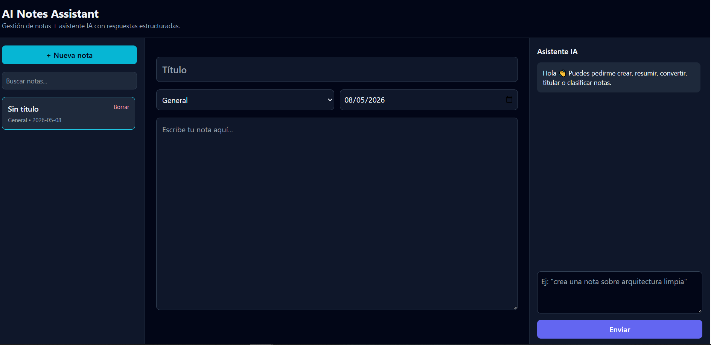
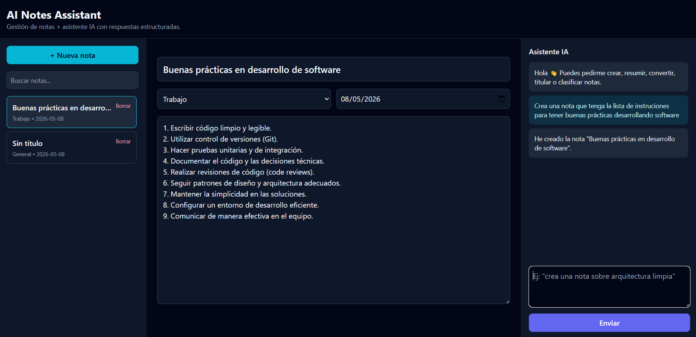
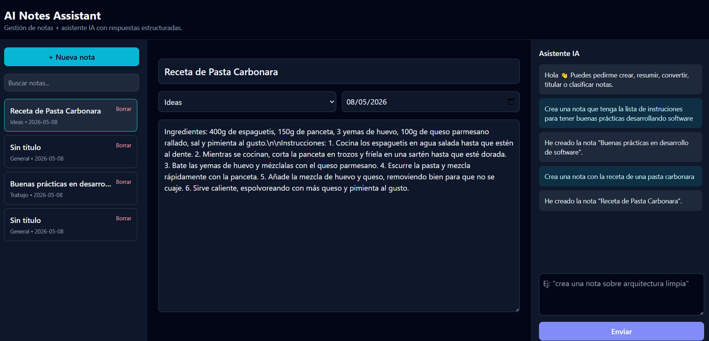

# AI Notes Assistant

Aplicacion de notas con asistente IA. Permite crear, editar, buscar y organizar notas, y usar un chatbot para automatizar acciones sobre ellas.

## 1) Para que sirve

- Gestion personal de notas.
- Productividad con ayuda de IA:
  - crear nota,
  - resumir nota,
  - convertir en tareas,
  - sugerir titulo,
  - clasificar categoria,
  - editar nota seleccionada.

## 2) Capturas





## 3) Stack

- React 18 + TypeScript + Vite
- TailwindCSS
- OpenAI Responses API via `api/chat.ts`
- Supabase (tabla `notes`) para persistencia remota
- Fallback a `localStorage` si Supabase no esta configurado
- Vitest + Testing Library

## 4) Arquitectura

Estructura principal:

- `src/domain/*`: entidades y tipos de dominio
- `src/application/*`: logica de aplicacion
- `src/infrastructure/supabase/*`: cliente Supabase
- `src/infrastructure/persistence/*`: repositorios y fallback local
- `src/features/ai-assistant/*`: contratos, parser y servicios de IA
- `src/components/*`: UI
- `api/chat.ts`: endpoint backend para OpenAI

Regla clave: la UI no habla directo con Supabase, usa repositorios de infraestructura.

## 5) Flujo de notas

1. Al iniciar, se cargan notas desde Supabase.
2. Si Supabase no esta configurado, carga desde localStorage.
3. Crear/editar/eliminar notas usa el repositorio de notas.
4. Si el chatbot crea una nota, se persiste por el mismo repositorio.

## 6) Instalacion

Requisitos:

- Node.js 20+
- npm

Comandos:

```bash
npm ci
cp .env.example .env
npm run dev
```

## 7) Variables de entorno

Frontend (publicas, permitidas):

```bash
VITE_SUPABASE_URL=your_supabase_project_url
VITE_SUPABASE_ANON_KEY=your_supabase_anon_key
```

Backend IA:

```bash
OPENAI_API_KEY=your_openai_api_key_here
OPENAI_MODEL=gpt-4o-mini
OPENAI_MAX_OUTPUT_TOKENS=200
OPENAI_MAX_MESSAGE_CHARS=800
OPENAI_MAX_NOTE_CHARS=3000
```

Importante:

- No usar `service_role` key en frontend.
- No exponer claves sensibles en el cliente.

## 8) Supabase: tabla notes

SQL incluido en:

- `supabase/schema.sql`
- `supabase/seed.sql`

Estructura:

- `notes`
  - `id uuid primary key default gen_random_uuid()`
  - `title text not null`
  - `content text not null`
  - `category text`
  - `created_at timestamptz default now()`
  - `updated_at timestamptz default now()`

Pasos:

1. Crea tu proyecto Supabase.
2. Abre SQL Editor.
3. Ejecuta el archivo `supabase/schema.sql`.
4. Copia URL y anon key al `.env`.
5. Opcional: ejecuta `supabase/seed.sql` para cargar notas de ejemplo.

Nota: el `schema.sql` ya incluye policies RLS para el rol `anon` (sin autenticacion), necesarias para esta fase del proyecto.

## 9) Scripts

```bash
npm run dev
npm run build
npm run preview
npm run test
npm run test:watch
npm run test:coverage
npm run lint
```

## 10) Despliegue

En Vercel:

1. Importa el repo.
2. Configura variables de entorno (Preview y Production).
3. Deploy.
4. Verifica `POST /api/chat`.

## 11) Troubleshooting

- `Server misconfigured`: falta `OPENAI_API_KEY` en el deploy.
- `AI service unavailable (502)`: fallo aguas arriba del proveedor IA.
- Si no hay Supabase configurado, la app entra automaticamente en fallback localStorage.
- Primera llamada al chatbot puede tardar por cold start serverless.

## 12) Calidad y tests

La suite cubre:

- carga de notas,
- crear/actualizar/eliminar nota,
- fallback a localStorage cuando Supabase no esta configurado,
- creacion de nota desde chatbot persistida en repositorio.
